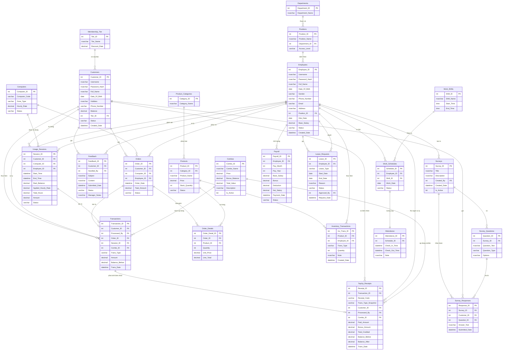

# Tài liệu Thiết kế Cơ sở Dữ liệu
## Internet Cafe Management System — Database Design

> **Phiên bản:** 1.2 | **Ngày:** 05/10/2026 | **RDBMS:** Microsoft SQL Server
> **Database:** `InternetCafeDB` | **Số bảng:** 24

---

## 1. Lược đồ CSDL (Entity Relationship Diagram)

---

## 2. Bảng Mô tả Cơ sở Dữ liệu (Data Dictionary)

### 📌 Module: HRM — Quản lý Nhân sự

---

#### Bảng `Departments` — Phòng ban

| Tên Cột | Kiểu Dữ liệu | Khóa | Null/Not Null | Mô tả |
|---|---|---|---|---|
| `Department_ID` | `INT IDENTITY(1,1)` | PK | NOT NULL | Mã phòng ban, tự tăng |
| `Department_Name` | `NVARCHAR(100)` | — | NOT NULL | Tên phòng ban (VD: Vận hành, Kỹ thuật) |

---

#### Bảng `Positions` — Chức vụ

| Tên Cột | Kiểu Dữ liệu | Khóa | Null/Not Null | Mô tả |
|---|---|---|---|---|
| `Position_ID` | `INT IDENTITY(1,1)` | PK | NOT NULL | Mã chức vụ, tự tăng |
| `Position_Name` | `NVARCHAR(100)` | — | NOT NULL | Tên chức vụ (VD: Quản lý ca, Thu ngân) |
| `Department_ID` | `INT` | FK → Departments | NOT NULL | Chức vụ thuộc phòng ban nào |
| `Access_Level` | `VARCHAR(20)` | — | NOT NULL | Cấp quyền truy cập: `Admin`, `Manager`, `Staff` |

---

#### Bảng `Employees` — Nhân viên

| Tên Cột | Kiểu Dữ liệu | Khóa | Null/Not Null | Mô tả |
|---|---|---|---|---|
| `Employee_ID` | `INT IDENTITY(1,1)` | PK | NOT NULL | Mã nhân viên, tự tăng |
| `Username` | `NVARCHAR(50)` | UNIQUE | NOT NULL | Tên đăng nhập (duy nhất) |
| `Password_Hash` | `NVARCHAR(255)` | — | NOT NULL | Mật khẩu đã mã hóa hash |
| `Full_Name` | `NVARCHAR(100)` | — | NOT NULL | Họ và tên đầy đủ |
| `Date_Of_Birth` | `DATE` | — | NULL | Ngày sinh |
| `Gender` | `VARCHAR(10)` | — | NULL | Giới tính: `Nam`, `Nữ`, `Khác` |
| `Phone_Number` | `VARCHAR(15)` | — | NULL | Số điện thoại liên hệ |
| `Email` | `VARCHAR(100)` | — | NULL | Địa chỉ email |
| `Address` | `NVARCHAR(255)` | — | NULL | Địa chỉ nơi ở |
| `Position_ID` | `INT` | FK → Positions | NOT NULL | Chức vụ đảm nhiệm |
| `Hire_Date` | `DATE` | — | NOT NULL | Ngày vào làm (mặc định: ngày hiện tại) |
| `Base_Salary` | `DECIMAL(12,2)` | — | NOT NULL | Lương cơ bản (VNĐ) |
| `Status` | `VARCHAR(20)` | — | NOT NULL | Trạng thái: `Active`, `Resigned`, `Suspended` |
| `Created_Date` | `DATETIME` | — | NOT NULL | Ngày tạo tài khoản |

---

#### Bảng `Work_Shifts` — Ca làm việc

| Tên Cột | Kiểu Dữ liệu | Khóa | Null/Not Null | Mô tả |
|---|---|---|---|---|
| `Shift_ID` | `INT IDENTITY(1,1)` | PK | NOT NULL | Mã ca, tự tăng |
| `Shift_Name` | `NVARCHAR(50)` | — | NOT NULL | Tên ca (VD: Ca sáng, Ca chiều, Ca tối) |
| `Start_Time` | `TIME` | — | NOT NULL | Giờ bắt đầu ca |
| `End_Time` | `TIME` | — | NOT NULL | Giờ kết thúc ca |

---

#### Bảng `Work_Schedules` — Lịch phân công ca

| Tên Cột | Kiểu Dữ liệu | Khóa | Null/Not Null | Mô tả |
|---|---|---|---|---|
| `Schedule_ID` | `INT IDENTITY(1,1)` | PK | NOT NULL | Mã lịch phân công |
| `Employee_ID` | `INT` | FK → Employees | NOT NULL | Nhân viên được phân công |
| `Shift_ID` | `INT` | FK → Work_Shifts | NOT NULL | Ca làm việc được phân |
| `Work_Date` | `DATE` | — | NOT NULL | Ngày làm việc cụ thể |
| `Status` | `VARCHAR(20)` | — | NOT NULL | Trạng thái: `Scheduled`, `Completed`, `Absent`, `OnLeave` |

> ⚠️ **Ràng buộc:** UNIQUE `(Employee_ID, Work_Date, Shift_ID)` — mỗi nhân viên chỉ có 1 ca mỗi ngày

---

#### Bảng `Attendance` — Chấm công

| Tên Cột | Kiểu Dữ liệu | Khóa | Null/Not Null | Mô tả |
|---|---|---|---|---|
| `Attendance_ID` | `INT IDENTITY(1,1)` | PK | NOT NULL | Mã bản ghi chấm công |
| `Schedule_ID` | `INT` | FK → Work_Schedules (UNIQUE) | NOT NULL | Lịch phân công tương ứng (quan hệ 1-1) |
| `Check_In_Time` | `DATETIME` | — | NULL | Thời điểm nhân viên check-in |
| `Check_Out_Time` | `DATETIME` | — | NULL | Thời điểm nhân viên check-out |
| `Note` | `NVARCHAR(255)` | — | NULL | Ghi chú (đi trễ, về sớm...) |

---

#### Bảng `Leave_Requests` — Đơn xin nghỉ phép

| Tên Cột | Kiểu Dữ liệu | Khóa | Null/Not Null | Mô tả |
|---|---|---|---|---|
| `Leave_ID` | `INT IDENTITY(1,1)` | PK | NOT NULL | Mã đơn nghỉ phép |
| `Employee_ID` | `INT` | FK → Employees | NOT NULL | Nhân viên xin nghỉ |
| `Leave_Type` | `VARCHAR(20)` | — | NOT NULL | Loại nghỉ: `Annual`, `Sick`, `Unpaid` |
| `Start_Date` | `DATE` | — | NOT NULL | Ngày bắt đầu nghỉ |
| `End_Date` | `DATE` | — | NOT NULL | Ngày kết thúc nghỉ |
| `Reason` | `NVARCHAR(255)` | — | NULL | Lý do xin nghỉ |
| `Status` | `VARCHAR(20)` | — | NOT NULL | Trạng thái: `Pending`, `Approved`, `Rejected` |
| `Approved_By` | `INT` | FK → Employees | NULL | Quản lý duyệt đơn |
| `Request_Date` | `DATETIME` | — | NOT NULL | Ngày nộp đơn |

---

#### Bảng `Payroll` — Bảng lương

| Tên Cột | Kiểu Dữ liệu | Khóa | Null/Not Null | Mô tả |
|---|---|---|---|---|
| `Payroll_ID` | `INT IDENTITY(1,1)` | PK | NOT NULL | Mã bản ghi lương |
| `Employee_ID` | `INT` | FK → Employees | NOT NULL | Nhân viên nhận lương |
| `Pay_Month` | `INT` | — | NOT NULL | Tháng tính lương (1–12) |
| `Pay_Year` | `INT` | — | NOT NULL | Năm tính lương |
| `Base_Salary` | `DECIMAL(12,2)` | — | NOT NULL | Lương cơ bản tháng này |
| `Bonus` | `DECIMAL(12,2)` | — | NOT NULL | Thưởng (mặc định 0) |
| `Deduction` | `DECIMAL(12,2)` | — | NOT NULL | Khấu trừ (mặc định 0) |
| `Net_Salary` | `DECIMAL(12,2)` | — | **COMPUTED** | Lương thực nhận = Base + Bonus - Deduction |
| `Payment_Date` | `DATETIME` | — | NULL | Ngày thực chi lương |
| `Status` | `VARCHAR(20)` | — | NOT NULL | Trạng thái: `Unpaid`, `Paid` |

> ⚠️ **Ràng buộc:** UNIQUE `(Employee_ID, Pay_Month, Pay_Year)` — mỗi NV chỉ có 1 bản lương/tháng

---

### 📌 Module: CRM — Quản lý Khách hàng

---

#### Bảng `Membership_Tier` — Cấp bậc thành viên

| Tên Cột | Kiểu Dữ liệu | Khóa | Null/Not Null | Mô tả |
|---|---|---|---|---|
| `Tier_ID` | `INT IDENTITY(1,1)` | PK | NOT NULL | Mã cấp bậc |
| `Tier_Name` | `NVARCHAR(50)` | — | NOT NULL | Tên cấp (VD: Member, VIP, Silver, Gold) |
| `Discount_Rate` | `DECIMAL(5,2)` | — | NOT NULL | Tỷ lệ chiết khấu (%) áp dụng cho cấp bậc |

---

#### Bảng `Customers` — Khách hàng

| Tên Cột | Kiểu Dữ liệu | Khóa | Null/Not Null | Mô tả |
|---|---|---|---|---|
| `Customer_ID` | `INT IDENTITY(1,1)` | PK | NOT NULL | Mã khách hàng, tự tăng |
| `Username` | `NVARCHAR(50)` | UNIQUE | NOT NULL | Tên đăng nhập (duy nhất) |
| `Password_Hash` | `NVARCHAR(255)` | — | NOT NULL | Mật khẩu đã hash |
| `Full_Name` | `NVARCHAR(100)` | — | NOT NULL | Họ và tên |
| `Date_Of_Birth` | `DATE` | — | NULL | Ngày sinh |
| `Hobbies` | `NVARCHAR(255)` | — | NULL | Sở thích (để cá nhân hóa dịch vụ) |
| `Phone_Number` | `VARCHAR(15)` | — | NULL | Số điện thoại |
| `Balance` | `DECIMAL(12,2)` | — | NOT NULL | Số dư tài khoản hiện tại (VNĐ, ≥ 0) |
| `Tier_ID` | `INT` | FK → Membership_Tier | NOT NULL | Cấp bậc thành viên |
| `Status` | `VARCHAR(20)` | — | NOT NULL | Trạng thái: `Active`, `Banned`, `Inactive` |
| `Created_Date` | `DATETIME` | — | NOT NULL | Ngày tạo tài khoản |

---

#### Bảng `Surveys` — Khảo sát

| Tên Cột | Kiểu Dữ liệu | Khóa | Null/Not Null | Mô tả |
|---|---|---|---|---|
| `Survey_ID` | `INT IDENTITY(1,1)` | PK | NOT NULL | Mã khảo sát |
| `Title` | `NVARCHAR(200)` | — | NOT NULL | Tiêu đề khảo sát |
| `Description` | `NVARCHAR(MAX)` | — | NULL | Mô tả / mục đích khảo sát |
| `Created_By` | `INT` | FK → Employees | NULL | Nhân viên/quản lý tạo khảo sát |
| `Created_Date` | `DATETIME` | — | NOT NULL | Ngày tạo |
| `Is_Active` | `BIT` | — | NOT NULL | Khảo sát đang hoạt động (1) hay đã đóng (0) |

---

#### Bảng `Survey_Questions` — Câu hỏi khảo sát

| Tên Cột | Kiểu Dữ liệu | Khóa | Null/Not Null | Mô tả |
|---|---|---|---|---|
| `Question_ID` | `INT IDENTITY(1,1)` | PK | NOT NULL | Mã câu hỏi |
| `Survey_ID` | `INT` | FK → Surveys | NOT NULL | Thuộc khảo sát nào |
| `Question_Text` | `NVARCHAR(MAX)` | — | NOT NULL | Nội dung câu hỏi |
| `Question_Type` | `VARCHAR(20)` | — | NOT NULL | Loại câu hỏi: `Choice`, `Text` |
| `Options` | `NVARCHAR(MAX)` | — | NULL | Các lựa chọn (phân cách bằng dấu phẩy) |

---

#### Bảng `Survey_Responses` — Câu trả lời khảo sát

| Tên Cột | Kiểu Dữ liệu | Khóa | Null/Not Null | Mô tả |
|---|---|---|---|---|
| `Response_ID` | `INT IDENTITY(1,1)` | PK | NOT NULL | Mã câu trả lời |
| `Survey_ID` | `INT` | FK → Surveys | NOT NULL | Thuộc khảo sát nào |
| `Customer_ID` | `INT` | FK → Customers | NOT NULL | Khách hàng trả lời |
| `Question_ID` | `INT` | FK → Survey_Questions | NOT NULL | Câu hỏi được trả lời |
| `Answer_Text` | `NVARCHAR(MAX)` | — | NOT NULL | Nội dung câu trả lời |
| `Submitted_Date` | `DATETIME` | — | NOT NULL | Thời điểm nộp câu trả lời |

---

#### Bảng `Feedback` — Phản hồi / Khiếu nại

| Tên Cột | Kiểu Dữ liệu | Khóa | Null/Not Null | Mô tả |
|---|---|---|---|---|
| `Feedback_ID` | `INT IDENTITY(1,1)` | PK | NOT NULL | Mã phản hồi |
| `Customer_ID` | `INT` | FK → Customers | NOT NULL | Khách hàng gửi phản hồi |
| `Handled_By` | `INT` | FK → Employees | NULL | Nhân viên phụ trách xử lý |
| `Subject` | `NVARCHAR(100)` | — | NOT NULL | Tiêu đề / chủ đề phản hồi |
| `Content` | `NVARCHAR(MAX)` | — | NOT NULL | Nội dung phản hồi chi tiết |
| `Submitted_Date` | `DATETIME` | — | NOT NULL | Ngày gửi phản hồi |
| `Status` | `VARCHAR(20)` | — | NOT NULL | Trạng thái: `Pending`, `Reviewed`, `Resolved` |
| `Manager_Notes` | `NVARCHAR(MAX)` | — | NULL | Ghi chú xử lý của quản lý |

---

### 📌 Module: ORDER — Quản lý Bán hàng F&B

---

#### Bảng `Product_Categories` — Danh mục sản phẩm

| Tên Cột | Kiểu Dữ liệu | Khóa | Null/Not Null | Mô tả |
|---|---|---|---|---|
| `Category_ID` | `INT IDENTITY(1,1)` | PK | NOT NULL | Mã danh mục |
| `Category_Name` | `NVARCHAR(100)` | — | NOT NULL | Tên danh mục (VD: Thức uống, Đồ ăn, Ăn vặt) |

---

#### Bảng `Products` — Sản phẩm

| Tên Cột | Kiểu Dữ liệu | Khóa | Null/Not Null | Mô tả |
|---|---|---|---|---|
| `Product_ID` | `INT IDENTITY(1,1)` | PK | NOT NULL | Mã sản phẩm |
| `Category_ID` | `INT` | FK → Product_Categories | NOT NULL | Danh mục sản phẩm |
| `Product_Name` | `NVARCHAR(100)` | — | NOT NULL | Tên sản phẩm |
| `Price` | `DECIMAL(12,2)` | — | NOT NULL | Đơn giá bán (VNĐ, ≥ 0) |
| `Stock_Quantity` | `INT` | — | NOT NULL | Số lượng tồn kho (≥ 0) |
| `Status` | `VARCHAR(20)` | — | NOT NULL | Trạng thái: `Active`, `Discontinued` |

---

#### Bảng `Combos` — Gói nạp tiền khuyến mãi

| Tên Cột | Kiểu Dữ liệu | Khóa | Null/Not Null | Mô tả |
|---|---|---|---|---|
| `Combo_ID` | `INT IDENTITY(1,1)` | PK | NOT NULL | Mã combo |
| `Combo_Name` | `NVARCHAR(100)` | — | NOT NULL | Tên combo (VD: Nạp 50k tặng 20k) |
| `Price` | `DECIMAL(12,2)` | — | NOT NULL | Số tiền khách thực nạp (VNĐ) |
| `Bonus_Balance` | `DECIMAL(12,2)` | — | NOT NULL | Số dư tặng thêm (VNĐ) |
| `Total_Value` | `DECIMAL(12,2)` | — | **COMPUTED** | Tổng giá trị nhận được = Price + Bonus_Balance |
| `Description` | `NVARCHAR(MAX)` | — | NULL | Mô tả chi tiết combo |
| `Is_Active` | `BIT` | — | NOT NULL | Combo đang áp dụng (1) hay ngừng (0) |

---

#### Bảng `Orders` — Đơn hàng F&B

| Tên Cột | Kiểu Dữ liệu | Khóa | Null/Not Null | Mô tả |
|---|---|---|---|---|
| `Order_ID` | `INT IDENTITY(1,1)` | PK | NOT NULL | Mã đơn hàng |
| `Customer_ID` | `INT` | FK → Customers | NOT NULL | Khách hàng đặt hàng |
| `Computer_ID` | `INT` | FK → Computers | NULL | Máy trạm của khách (để giao đồ) |
| `Employee_ID` | `INT` | FK → Employees | NULL | Nhân viên phụ trách đơn hàng |
| `Order_Date` | `DATETIME` | — | NOT NULL | Thời điểm đặt hàng |
| `Total_Amount` | `DECIMAL(12,2)` | — | NOT NULL | Tổng tiền đơn hàng (VNĐ) |
| `Status` | `VARCHAR(20)` | — | NOT NULL | Trạng thái: `Pending`, `Preparing`, `Served`, `Cancelled` |

---

#### Bảng `Order_Details` — Chi tiết đơn hàng

| Tên Cột | Kiểu Dữ liệu | Khóa | Null/Not Null | Mô tả |
|---|---|---|---|---|
| `Order_Detail_ID` | `INT IDENTITY(1,1)` | PK | NOT NULL | Mã dòng chi tiết |
| `Order_ID` | `INT` | FK → Orders | NOT NULL | Thuộc đơn hàng nào |
| `Product_ID` | `INT` | FK → Products | NOT NULL | Sản phẩm được gọi |
| `Quantity` | `INT` | — | NOT NULL | Số lượng (> 0) |
| `Unit_Price` | `DECIMAL(12,2)` | — | NOT NULL | Đơn giá tại thời điểm đặt (snapshot) |
| `Line_Total` | `DECIMAL(12,2)` | — | **COMPUTED** | Thành tiền = Quantity × Unit_Price |

---

#### Bảng `Inventory_Transactions` — Giao dịch nhập/xuất kho

| Tên Cột | Kiểu Dữ liệu | Khóa | Null/Not Null | Mô tả |
|---|---|---|---|---|
| `Inv_Trans_ID` | `INT IDENTITY(1,1)` | PK | NOT NULL | Mã giao dịch kho |
| `Product_ID` | `INT` | FK → Products | NOT NULL | Sản phẩm được nhập/xuất |
| `Employee_ID` | `INT` | FK → Employees | NOT NULL | Nhân viên thực hiện |
| `Trans_Type` | `VARCHAR(20)` | — | NOT NULL | Loại giao dịch: `Import` (nhập), `Export` (xuất) |
| `Quantity` | `INT` | — | NOT NULL | Số lượng nhập/xuất |
| `Note` | `NVARCHAR(255)` | — | NULL | Ghi chú (lý do nhập, tên nhà cung cấp...) |
| `Created_Date` | `DATETIME` | — | NOT NULL | Thời điểm thực hiện giao dịch |

---

### 📌 Module: USAGE_SESSIONS — Quản lý Phiên chơi & Máy trạm

---

#### Bảng `Computers` — Máy trạm

| Tên Cột | Kiểu Dữ liệu | Khóa | Null/Not Null | Mô tả |
|---|---|---|---|---|
| `Computer_ID` | `INT IDENTITY(1,1)` | PK | NOT NULL | Mã máy trạm |
| `Computer_Code` | `VARCHAR(20)` | UNIQUE | NOT NULL | Mã hiển thị máy (VD: PC01, VIP01) |
| `Zone_Type` | `VARCHAR(20)` | — | NOT NULL | Khu vực: `Standard`, `VIP` |
| `Hourly_Rate` | `DECIMAL(10,2)` | — | NOT NULL | Giá thuê theo giờ (VNĐ) |
| `Status` | `VARCHAR(20)` | — | NOT NULL | Trạng thái: `Available`, `InUse`, `Maintenance` |

---

#### Bảng `Usage_Sessions` — Phiên chơi

| Tên Cột | Kiểu Dữ liệu | Khóa | Null/Not Null | Mô tả |
|---|---|---|---|---|
| `Session_ID` | `INT IDENTITY(1,1)` | PK | NOT NULL | Mã phiên chơi |
| `Customer_ID` | `INT` | FK → Customers | NOT NULL | Khách hàng sử dụng |
| `Computer_ID` | `INT` | FK → Computers | NOT NULL | Máy trạm được sử dụng |
| `Employee_ID` | `INT` | FK → Employees | NULL | Nhân viên mở phiên |
| `Start_Time` | `DATETIME` | — | NOT NULL | Thời điểm bắt đầu phiên |
| `End_Time` | `DATETIME` | — | NULL | Thời điểm kết thúc (NULL nếu đang chơi) |
| `Start_Balance` | `DECIMAL(12,2)` | — | NULL | Số dư tài khoản lúc bắt đầu phiên |
| `Applied_Hourly_Rate` | `DECIMAL(10,2)` | — | NULL | Snapshot giá/giờ áp dụng cho phiên; trigger tự lấy giá máy khi tạo phiên |
| `Total_Hours` | `DECIMAL(10,2)` | — | **COMPUTED** | Tổng số giờ chơi (tính từ phút, chia 60) |
| `Amount` | `DECIMAL(12,2)` | — | NULL | Số tiền thực thu phiên chơi; API giới hạn theo số dư hiện có và trả phần phí được miễn riêng trong response |
| `Status` | `VARCHAR(20)` | — | NOT NULL | Trạng thái: `Active`, `Completed`, `Cancelled` |

> **Ràng buộc nghiệp vụ:** UNIQUE filtered index chỉ cho phép một phiên `Active` trên mỗi máy. Trigger đồng bộ trạng thái máy dựa trên các phiên đang hoạt động, giữ nguyên trạng thái `Maintenance` và từ chối mở phiên trên máy bảo trì.

---

#### Bảng `Transactions` — Giao dịch tài chính

| Tên Cột | Kiểu Dữ liệu | Khóa | Null/Not Null | Mô tả |
|---|---|---|---|---|
| `Transaction_ID` | `INT IDENTITY(1,1)` | PK | NOT NULL | Mã giao dịch |
| `Customer_ID` | `INT` | FK → Customers | NOT NULL | Khách hàng liên quan |
| `Processed_By` | `INT` | FK → Employees | NULL | Nhân viên xử lý (NULL nếu tự động) |
| `Order_ID` | `INT` | FK → Orders (UNIQUE) | NULL | Liên kết đơn F&B (nếu loại FoodOrder) |
| `Session_ID` | `INT` | FK → Usage_Sessions (UNIQUE) | NULL | Liên kết phiên chơi (nếu loại Rental) |
| `Combo_ID` | `INT` | FK → Combos | NULL | Combo nạp tiền áp dụng |
| `Trans_Type` | `VARCHAR(20)` | — | NOT NULL | Loại GD: `TopUp`, `FoodOrder`, `Rental`, `Refund` |
| `Amount` | `DECIMAL(12,2)` | — | NOT NULL | Số tiền giao dịch (VNĐ, > 0) |
| `Balance_Before` | `DECIMAL(12,2)` | — | NULL | Snapshot số dư KH trước giao dịch — trigger tự điền khi NULL (chỉ có ý nghĩa với TopUp) |
| `Trans_Date` | `DATETIME` | — | NOT NULL | Thời điểm thực hiện |

---

#### Bảng `TopUp_Receipts` — Biên nhận nạp tiền

| Tên Cột | Kiểu Dữ liệu | Khóa | Null/Not Null | Mô tả |
|---|---|---|---|---|
| `Receipt_ID` | `INT IDENTITY(1,1)` | PK | NOT NULL | Mã biên nhận, tự tăng |
| `Transaction_ID` | `INT` | FK → Transactions (UNIQUE) | NOT NULL | Giao dịch TopUp tương ứng (quan hệ 1-1) |
| `Receipt_Code` | `VARCHAR` | — | **COMPUTED** | Mã tra cứu định dạng `RCP-YYYYMMDD-{Transaction_ID}`, PERSISTED |
| `Trans_Type_Snapshot` | `VARCHAR(10)` | CHECK = 'TopUp' | NOT NULL | Bản sao loại GD để CHECK hoạt động không cần cross-table join |
| `Customer_ID` | `INT` | FK → Customers | NOT NULL | Khách hàng nạp tiền |
| `Processed_By` | `INT` | FK → Employees | NULL | Nhân viên thu ngân thực hiện |
| `Combo_ID` | `INT` | FK → Combos | NULL | Combo áp dụng khi nạp (nếu có) |
| `Paid_Amount` | `DECIMAL(12,2)` | — | NOT NULL | Số tiền khách thực trả (VNĐ) |
| `Bonus_Amount` | `DECIMAL(12,2)` | — | NOT NULL | Tiền thưởng từ Combo (VNĐ, mặc định 0) |
| `Total_Credited` | `DECIMAL(12,2)` | — | **COMPUTED** | Tổng số dư được cộng = Paid + Bonus, PERSISTED |
| `Balance_Before` | `DECIMAL(12,2)` | — | NOT NULL | Số dư tài khoản trước khi nạp |
| `Balance_After` | `DECIMAL(12,2)` | — | **COMPUTED** | Số dư sau nạp = Before + Paid + Bonus, PERSISTED |
| `Trans_Date` | `DATETIME` | — | NOT NULL | Thời điểm giao dịch (sao chép từ Transactions) |

> ⚠️ **Ràng buộc:** UNIQUE `(Transaction_ID)` — 1 giao dịch TopUp → tối đa 1 biên nhận (chống tạo trùng khi retry).
> ⚠️ **Giới hạn CHECK cross-table:** SQL Server không cho phép CHECK tham chiếu bảng khác, vì vậy `Trans_Type_Snapshot` lưu bản sao `'TopUp'` để ràng buộc `CHK_Receipt_TopUpOnly` hoạt động nội trong bảng. Trigger `TR_Create_TopUp_Receipt` đảm bảo logic lọc đúng.

---

## 3. Tổng hợp quan hệ giữa các bảng

| Bảng Cha | Bảng Con | Kiểu QH | Cột FK | Ghi chú |
|---|---|---|---|---|
| `Departments` | `Positions` | 1 — N | `Department_ID` | Phòng ban có nhiều chức vụ |
| `Positions` | `Employees` | 1 — N | `Position_ID` | Chức vụ có nhiều nhân viên |
| `Membership_Tier` | `Customers` | 1 — N | `Tier_ID` | Hạng thành viên có nhiều KH |
| `Employees` | `Surveys` | 1 — N | `Created_By` | NV tạo nhiều khảo sát |
| `Surveys` | `Survey_Questions` | 1 — N | `Survey_ID` | Cascade Delete |
| `Surveys` | `Survey_Responses` | 1 — N | `Survey_ID` | Cascade Delete |
| `Customers` | `Survey_Responses` | 1 — N | `Customer_ID` | Cascade Delete |
| `Survey_Questions` | `Survey_Responses` | 1 — N | `Question_ID` | — |
| `Customers` | `Feedback` | 1 — N | `Customer_ID` | Cascade Delete |
| `Employees` | `Feedback` | 1 — N | `Handled_By` | — |
| `Customers` | `Usage_Sessions` | 1 — N | `Customer_ID` | — |
| `Computers` | `Usage_Sessions` | 1 — N | `Computer_ID` | — |
| `Employees` | `Usage_Sessions` | 1 — N | `Employee_ID` | — |
| `Customers` | `Orders` | 1 — N | `Customer_ID` | — |
| `Computers` | `Orders` | 1 — N | `Computer_ID` | — |
| `Employees` | `Orders` | 1 — N | `Employee_ID` | — |
| `Product_Categories` | `Products` | 1 — N | `Category_ID` | — |
| `Orders` | `Order_Details` | 1 — N | `Order_ID` | Cascade Delete |
| `Products` | `Order_Details` | 1 — N | `Product_ID` | — |
| `Products` | `Inventory_Transactions` | 1 — N | `Product_ID` | — |
| `Employees` | `Inventory_Transactions` | 1 — N | `Employee_ID` | — |
| `Customers` | `Transactions` | 1 — N | `Customer_ID` | — |
| `Employees` | `Transactions` | 1 — N | `Processed_By` | — |
| `Orders` | `Transactions` | 1 — 0/1 | `Order_ID` | UNIQUE Index |
| `Usage_Sessions` | `Transactions` | 1 — 0/1 | `Session_ID` | UNIQUE Index |
| `Combos` | `Transactions` | 1 — N | `Combo_ID` | — |
| `Transactions` | `TopUp_Receipts` | 1 — 0/1 | `Transaction_ID` | UNIQUE — chỉ TopUp |
| `Customers` | `TopUp_Receipts` | 1 — N | `Customer_ID` | — |
| `Employees` | `TopUp_Receipts` | 1 — N | `Processed_By` | — |
| `Combos` | `TopUp_Receipts` | 1 — N | `Combo_ID` | — |
| `Employees` | `Work_Schedules` | 1 — N | `Employee_ID` | Cascade Delete |
| `Work_Shifts` | `Work_Schedules` | 1 — N | `Shift_ID` | — |
| `Work_Schedules` | `Attendance` | 1 — 1 | `Schedule_ID` | UNIQUE, Cascade Delete |
| `Employees` | `Payroll` | 1 — N | `Employee_ID` | Cascade Delete |
| `Employees` | `Leave_Requests` | 1 — N | `Employee_ID` | Cascade Delete |
| `Employees` | `Leave_Requests` | 1 — N | `Approved_By` | Self-reference |

---

*Tài liệu được cập nhật phiên bản 1.2 (05/10/2026): bổ sung biên nhận nạp tiền, snapshot đơn giá phiên và các ràng buộc/trigger đồng bộ nghiệp vụ — InternetCafeDB*
