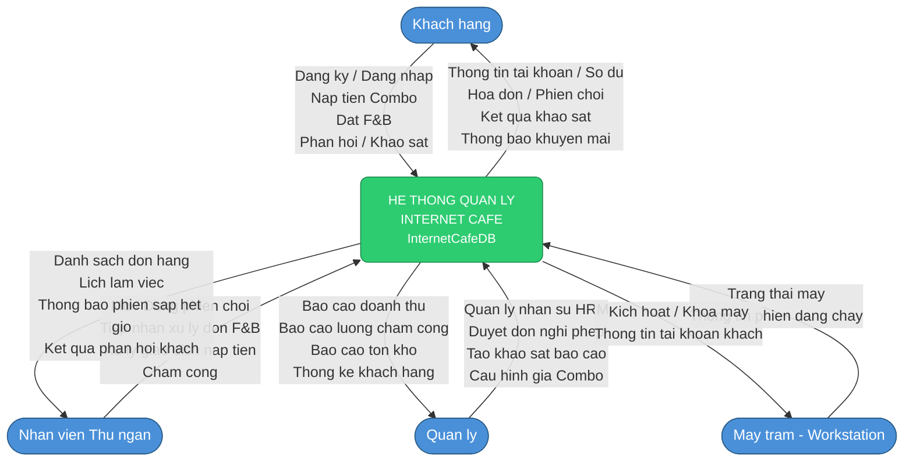
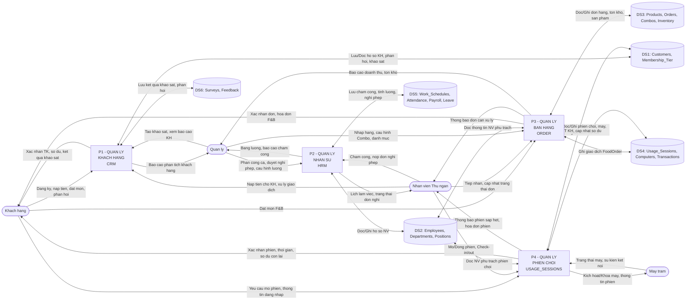

# Tài liệu Thiết kế Hệ thống Thông tin
## Internet Cafe Management System

> **Phiên bản:** 1.0 | **Ngày:** 29/09/2026 | **Người lập:** System Analyst

---

## 1. Sơ đồ Ngữ cảnh (Context Diagram)

Sơ đồ mô tả hệ thống quản lý Internet Cafe ở mức tổng quan nhất, thể hiện các tác nhân bên ngoài tương tác với hệ thống trung tâm.

---

## 2. Sơ đồ Chức năng (Business Function Diagram - BFD)

Phân rã toàn bộ các chức năng của hệ thống thành 4 phân hệ chính.

```mermaid
flowchart TD
    ROOT["HE THONG QUAN LY INTERNET CAFE"]

    ROOT --> CRM["1. CRM - Quan ly Khach hang"]
    CRM --> CRM1["1.1 Quan ly ho so khach hang"]
    CRM --> CRM2["1.2 Quan ly cap bac thanh vien"]
    CRM --> CRM3["1.3 Quan ly giao dich nap tien va so du"]
    CRM --> CRM4["1.4 Quan ly phan hoi va khieu nai"]
    CRM --> CRM5["1.5 Quan ly khao sat va cau hoi"]

    ROOT --> HRM["2. HRM - Quan ly Nhan su"]
    HRM --> HRM1["2.1 Quan ly phong ban va chuc vu"]
    HRM --> HRM2["2.2 Quan ly ho so nhan vien"]
    HRM --> HRM3["2.3 Quan ly ca lam viec va lich phan cong"]
    HRM --> HRM4["2.4 Quan ly cham cong"]
    HRM --> HRM5["2.5 Quan ly don nghi phep"]
    HRM --> HRM6["2.6 Quan ly tinh luong va bang luong"]

    ROOT --> ORD["3. ORDER - Quan ly Ban hang F&B"]
    ORD --> ORD1["3.1 Quan ly danh muc va san pham"]
    ORD --> ORD2["3.2 Tiep nhan va xu ly don hang"]
    ORD --> ORD3["3.3 Quan ly chi tiet don hang"]
    ORD --> ORD4["3.4 Quan ly kho nhap xuat hang"]
    ORD --> ORD5["3.5 Quan ly Combo va khuyen mai"]

    ROOT --> USG["4. USAGE_SESSIONS - Quan ly Phien choi"]
    USG --> USG1["4.1 Quan ly may tram va khu vuc"]
    USG --> USG2["4.2 Mo phien choi Check-in"]
    USG --> USG3["4.3 Theo doi phien dang hoat dong"]
    USG --> USG4["4.4 Ket thuc va tinh tien phien choi Check-out"]
    USG --> USG5["4.5 Quan ly lich su phien choi"]
```

---

## 3. Sơ đồ Luồng Dữ liệu Mức Đỉnh (DFD Level 0)

Thể hiện 4 tiến trình chính, các luồng dữ liệu với tác nhân ngoài và các kho dữ liệu.

---

*Tài liệu được tạo dựa trên schema `InternetCafe Final.sql` - InternetCafeDB*
